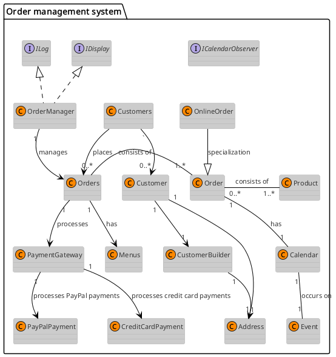
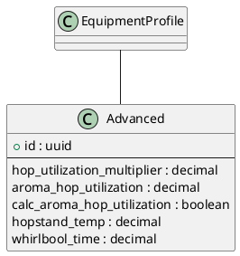
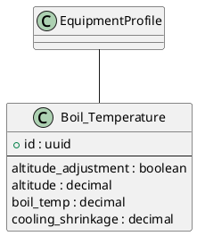
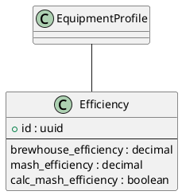
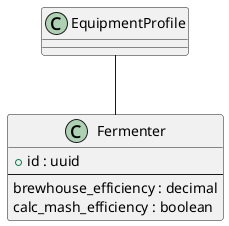
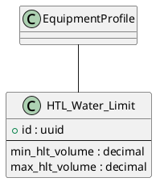
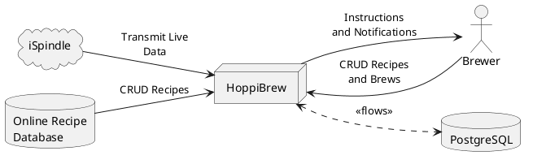
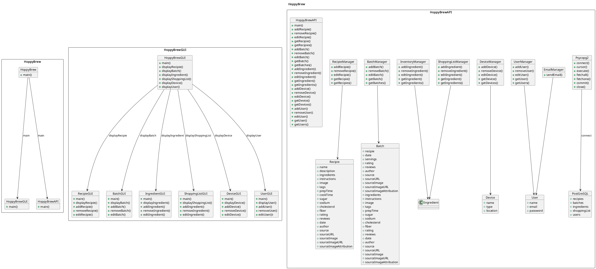

# Diagram Catalog

All diagrams are generated from `documents/docs/plantuml` via `scripts/render_plantuml_diagrams.py`. Use this catalog to find the embed-ready PNG/SVG artifacts.

## Architecture
### ComponentDiagram-HoppuBrew
 ([svg](diagrams/architecture/ComponentDiagram-HoppuBrew.svg))

## Database
### Adjunct
 ([svg](diagrams/database/Adjunct.svg))

### Advanced
 ([svg](diagrams/database/Advanced.svg))

### Anion
 ([svg](diagrams/database/Anion.svg))

### Boil_Temperature
 ([svg](diagrams/database/Boil_Temperature.svg))

### Cation
 ([svg](diagrams/database/Cation.svg))

### DryExtract
 ([svg](diagrams/database/DryExtract.svg))

### Efficiency
 ([svg](diagrams/database/Efficiency.svg))

### EquipmentProfile
 ([svg](diagrams/database/EquipmentProfile.svg))

### Fermentable_Category
 ([svg](diagrams/database/Fermentable_Category.svg))

### FermentationProfile
 ([svg](diagrams/database/FermentationProfile.svg))

### FermentationStep
 ([svg](diagrams/database/FermentationStep.svg))

### FermentationStepType
 ([svg](diagrams/database/FermentationStepType.svg))

### Fermenter
 ([svg](diagrams/database/Fermenter.svg))

### Grain
 ([svg](diagrams/database/Grain.svg))

### HTL_Water_Limit
 ([svg](diagrams/database/HTL_Water_Limit.svg))

### Hop
 ([svg](diagrams/database/Hop.svg))

### HopType
 ([svg](diagrams/database/HopType.svg))

### HopUsage
 ([svg](diagrams/database/HopUsage.svg))

### Kettle
 ([svg](diagrams/database/Kettle.svg))

### LiquidExtract
 ([svg](diagrams/database/LiquidExtract.svg))

### MashProfile
 ([svg](diagrams/database/MashProfile.svg))

### MashStep
 ([svg](diagrams/database/MashStep.svg))

### MashStepType
 ([svg](diagrams/database/MashStepType.svg))

### Mash_Sparge_Water
 ([svg](diagrams/database/Mash_Sparge_Water.svg))

### Mash_Sparge_Water_Calc_Method
 ([svg](diagrams/database/Mash_Sparge_Water_Calc_Method.svg))

### Mash_Volume_limit
 ([svg](diagrams/database/Mash_Volume_limit.svg))

### Misc
 ([svg](diagrams/database/Misc.svg))

### MiscType
 ([svg](diagrams/database/MiscType.svg))

### MiscUnit
 ([svg](diagrams/database/MiscUnit.svg))

### MiscUse
 ([svg](diagrams/database/MiscUse.svg))

### Other
 ([svg](diagrams/database/Other.svg))

### Sparge_Temperature
 ([svg](diagrams/database/Sparge_Temperature.svg))

### Sparge_Water_limit
 ([svg](diagrams/database/Sparge_Water_limit.svg))

### Stats
 ([svg](diagrams/database/Stats.svg))

### Strike_Water_Temp
 ([svg](diagrams/database/Strike_Water_Temp.svg))

### Sugar
 ([svg](diagrams/database/Sugar.svg))

### TargetStyle
 ([svg](diagrams/database/TargetStyle.svg))

### Volume
 ([svg](diagrams/database/Volume.svg))

### VolumeType
 ([svg](diagrams/database/VolumeType.svg))

### WaterProfile
 ([svg](diagrams/database/WaterProfile.svg))

### WaterProfileType
 ([svg](diagrams/database/WaterProfileType.svg))

### Yeast
 ([svg](diagrams/database/Yeast.svg))

### YeastFlocculation
 ([svg](diagrams/database/YeastFlocculation.svg))

### YeastForm
 ([svg](diagrams/database/YeastForm.svg))

### YeastType
 ([svg](diagrams/database/YeastType.svg))

### YeastUnit
 ([svg](diagrams/database/YeastUnit.svg))

## Misc
### 02-Context-Vew-Business
 ([svg](diagrams/misc/02-Context-Vew-Business.svg))

### 04-white-box-overall-system
 ([svg](diagrams/misc/04-white-box-overall-system.svg))

### Context-Vew copy
 ([svg](diagrams/misc/Context-Vew copy.svg))

### create-new-user
 ([svg](diagrams/misc/create-new-user.svg))

### d
 ([svg](diagrams/misc/d.svg))

> Missing a diagram? Add a `.puml` in the source directory, rerun the render script, and commit the updated assets.