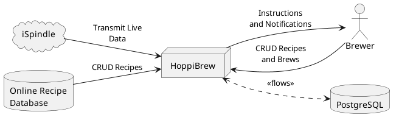
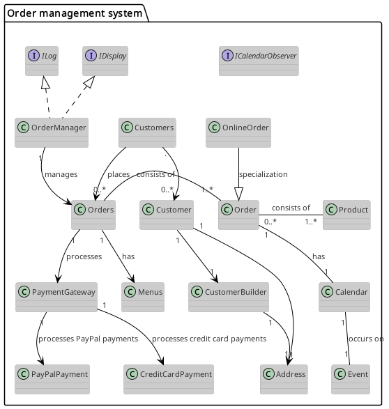
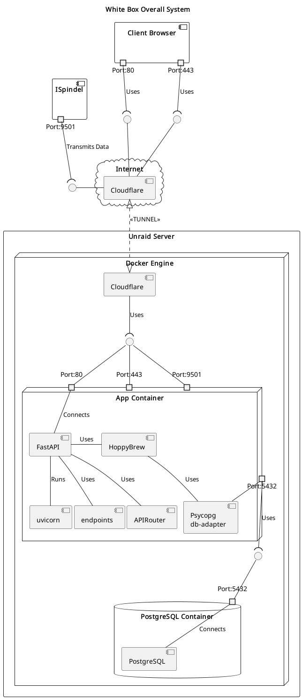
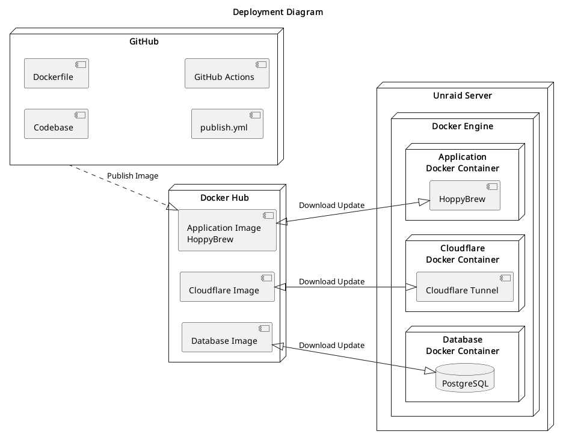

# Architecture

HoppyBrew is intentionally small—one Nuxt 3 frontend, one FastAPI backend, and a PostgreSQL datastore—but the platform still spans recipe management, inventory, brewing workflows, and third-party automation. This page captures how those parts interact and where each responsibility lives.

## System Context

1. **Brewer & Administrator** – Work exclusively through the Nuxt SPA and authenticated API calls.
2. **Connected Devices** – ISpindel and similar hydrometers stream telemetry via REST hooks and appear inside the batches module.
3. **HomeAssistant** – Pulls REST sensors (and future MQTT discovery) to surface brew status dashboards.
4. **Cloudflare Tunnel** – Fronts the self-hosted Unraid deployment for secure remote access.

## Logical View

| Component | Responsibilities | Implementation |
| --- | --- | --- |
| Client (Nuxt 3 + shadcn-vue) | Recipe editor, inventory UI, brew day workflows, calculators | `services/nuxt3-shadcn` with composables (`useRecipes`, `useBatches`, `useInventory`, …) per [FRONTEND_ARCHITECTURE.md](../services/nuxt3-shadcn/FRONTEND_ARCHITECTURE.md) |
| API Gateway (FastAPI) | Validates payloads, enforces domain rules, exposes resource routers grouped by tags | `services/backend/main.py` and `api/router.py` with per-domain submodules |
| Domain Modules | Brewing calculations, reference import/export, BJCP style refresh, HomeAssistant formatting | `services/backend/modules/*`, `api/endpoints/*`, `Database/Schemas/*` |
| Persistence Layer | Normalized SQLAlchemy models, Alembic migrations, PostgreSQL extensions | `services/backend/Database/Models`, `alembic/` |
| Observability | Structured logging + `logs` endpoint, health probes, docker healthchecks | `services/backend/logger_config.py`, `/health` endpoint |

## Runtime View

- **Network Entry** – Cloudflare tunnel terminates 80/443/9501 and forwards into the Unraid Docker host.
- **Application Container** – Runs Uvicorn + FastAPI with the APIRouter wiring every domain router (`recipes`, `inventory`, `profiles`, `homeassistant`, etc.).
- **Database Container** – PostgreSQL 16-alpine accessed exclusively over the docker network; SQLAlchemy engines are configured in `services/backend/database.py`.
- **Device Telemetry** – ISpindel pushes to port 9501 which is proxied into the API container where batches are updated.

## Deployment Topology

1. GitHub holds source, Dockerfiles, and CI workflows that publish versioned images.
2. Docker Hub stores application, Cloudflare tunnel, and database images for the Unraid host.
3. Unraid orchestrates three containers (app, postgres, Cloudflare) via Docker Compose; `docker-compose.prod.yml` illustrates the target state.
4. Remote management happens through Cloudflare -> Tunnel -> HoppyBrew container -> Postgres.

## Cross-cutting Concerns

- **Authentication & Authorization** – Currently token-less; upcoming milestones add user sessions (see `users` router). Restrict exposure via VPN/Cloudflare access policies.
- **Configuration** – `.env` drives database host/user/password, API base URLs, and testing toggles. Compose files inject secrets via `env_file` blocks.
- **Logging** – `logger_config.get_logger` enforces JSON-formatted logs; log scraping endpoints expose the rolling buffer for UI debugging.
- **Resilience** – Docker health checks ensure API and Postgres restart on failure. Alembic migrations run on boot; seeding scripts are idempotent.
- **Documentation Source of Truth** – `.puml` diagrams + `scripts/render_plantuml_diagrams.py` keep this page synchronized with the models.

## Future Architecture Work

- Externalize authentication/authorization (OAuth or custom token service) so API can be safely exposed beyond tunnels.
- Introduce background workers for long-running calculations (BJCP imports, brewing simulations) to keep API latencies < 500 ms.
- Expand device ingestion (Tilt, Grainfather) via WebSocket or MQTT sidecars.
- Harden observability with Prometheus scraping, Loki log shipping, and alerting hooks tied into HomeAssistant automations.
