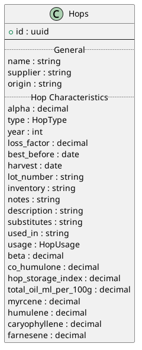
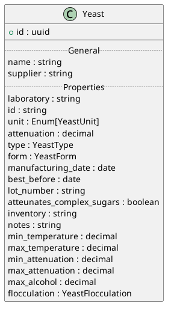
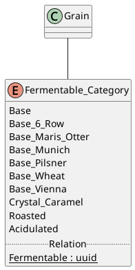
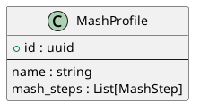
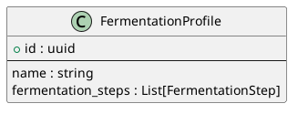
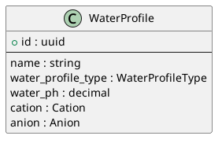
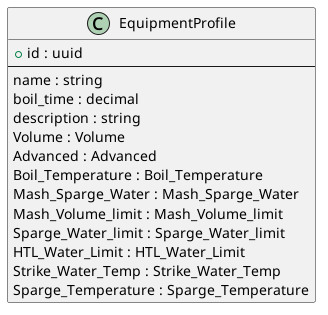

# Database Schema

The HoppyBrew schema is intentionally normalized so recipes, batches, profiles, and inventory stay modular. SQLAlchemy models live under `services/backend/Database/Models`, while the outward-facing serializers are under `Database/Schemas`. Alembic migrations guard every schema change.

## Design Principles

1. **Domain isolation** – Ingredients, profiles, references, and operational data (batches/recipes) sit in their own tables to prevent accidental cascades.
2. **Metric-first data** – All persisted values use SI units (grams, liters, Celsius). Imperial conversions happen in the frontend.
3. **Reference data baked in** – BJCP styles, water chemistry presets, and equipment templates ship as seed data so new installs are functional immediately.
4. **Audit friendliness** – `logs` and `questions` tables give historical context for brew sessions and troubleshooting.

## Core Entities

### Recipes & Batches

- **`recipes`** – Stores metadata, targets (ABV/IBU), linked fermentables/hops/yeast through association tables, and per-step notes.
- **`batches`** – Instances of recipes moving through the workflow states. Includes gravity/temperature readings and packaging data.
- **`batch_logs`** – Timestamped entries captured via the API (brew day notes, fermentation events).

### Inventory & Ingredients

- Each ingredient has its own specialized table (`hops`, `yeasts`, `fermentables`, `miscs`) with characteristics such as alpha acids, attenuation, lovibond, form, and usage hints.
- **`inventory`** rows reference exactly one ingredient type. Quantity tracking lives here so recipes stay immutable.
- Ingredient subtypes (e.g., Adjunct, DryExtract) extend the base fermentable definition rather than duplicating columns.

### Profiles & Process Templates

- **Mash profiles** capture temperature steps, durations, and medium (infusion, decoction, etc.). Steps live in `mash_steps` with types defined in `mash_step_types`.
- **Fermentation profiles** manage multi-stage fermentation temperatures/durations, enabling predictive attenuation calculations.
- **Water profiles** describe base mineral content plus recommended adjustments (cations/anions/acid additions).
- **Equipment profiles** define tun volumes, boil-off rates, mash water limits, strike temperatures, and batch size defaults.

### Reference Data

- **`beer_styles` / `style_categories` / `style_guideline_sources`** – Mirror BJCP hierarchy. Use `/refresh-beer-styles` to re-import from canonical sources.
- **`choices` tables** – Enumerate units, usage types, and permissible categorical values (e.g., `HopUsage`, `YeastType`). Each has matching Pydantic enums.

## Entity Relationship Highlights

- Recipes reference `equipment_profile_id`, `mash_profile_id`, `fermentation_profile_id`, and `water_profile_id`, ensuring brew-day calculations always have the necessary context.
- Inventory rows point back to both the base ingredient (`hop_id`, `fermentable_id`, etc.) and the recipe/batch they were last consumed by.
- Device metadata (`devices` table) links to batches for telemetry correlation and to HomeAssistant sensors for discovery.

## Schema Evolution

1. **Model updates** happen inside `services/backend/Database/Models`.
2. **Migration** – run `make db-migrate msg="describe change"` followed by `make db-upgrade` or `alembic upgrade head` inside `services/backend`.
3. **Seed data** – update `services/backend/seeds` as needed. Rerun `python seeds/seed_all.py` to refresh.
4. **Documentation** – adjust or add `.puml` diagrams under `documents/docs/plantuml/ERD` and re-run `scripts/render_plantuml_diagrams.py` so this page stays in sync.

> ⚠️ **Aggregated ERDs** (`ERD.puml`, `Inventory.puml`, `Recipie.puml`, `ingredients/Fermentable.puml`) include nested `@startuml` blocks and cannot be auto-rendered. Keep them for design context, but favor the atomic diagrams above for automation and wiki embeds.
